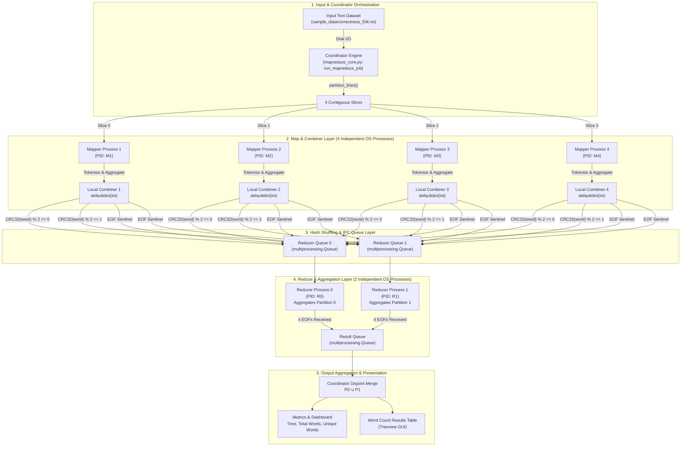

# INTE 22253 — Cloud Computing (Part C: Option 2)
# Comprehensive Architectural Analysis & Deep-Dive Specification

**Project Title:** Local Multiprocessing MapReduce Word Count Simulation  
**Module:** INTE 22253 — Cloud Computing  
**Author:** Student Technical Analysis  
**Repository:** `MapReduce/`  
**Core Technologies:** Python 3, `multiprocessing`, `threading`, `zlib (CRC32)`, `tkinter`, `collections.defaultdict`, `time.perf_counter`  

---

## Table of Contents
1. [Theoretical Foundations & Distributed Computing Paradigm](#1-theoretical-foundations--distributed-computing-paradigm)
2. [Global Architecture & Component Topology](#2-global-architecture--component-topology)
3. [Process Model, Memory Spaces & GIL Bypass](#3-process-model-memory-spaces--gil-bypass)
4. [Inter-Process Communication (IPC) & Queue Engineering](#4-inter-process-communication-ipc--queue-engineering)
5. [Algorithmic Stage-by-Stage Mathematical Analysis](#5-algorithmic-stage-by-stage-mathematical-analysis)
   - [5.1 Partitioning Stage](#51-partitioning-stage)
   - [5.2 Map & Normalization Stage](#52-map--normalization-stage)
   - [5.3 Combiner Stage (Local Aggregation)](#53-combiner-stage-local-aggregation)
   - [5.4 Shuffle & CRC32 Partitioning Stage](#54-shuffle--crc32-partitioning-stage)
   - [5.5 Reduce Stage & Deterministic EOF Protocol](#55-reduce-stage--deterministic-eof-protocol)
   - [5.6 Output Merge Stage](#56-output-merge-stage)
6. [GUI Concurrency & Event Loop Synchronization](#6-gui-concurrency--event-loop-synchronization)
7. [Complexity Analysis, Amdahl's Law & Scalability](#7-complexity-analysis-amdahls-law--scalability)
8. [Correctness Verification & Validation Strategy](#8-correctness-verification--validation-strategy)
9. [Comprehensive Viva Voce Examination Defense](#9-comprehensive-viva-voce-examination-defense)

---

## 1. Theoretical Foundations & Distributed Computing Paradigm

In distributed and cloud computing, Google’s **MapReduce** (Dean & Ghemawat, OSDI 2004) was designed to process massive datasets across distributed server clusters using commodity hardware. 

The core philosophy of MapReduce rests on three architectural tenets:
1. **Functional Abstraction:** Expressing complex data processing pipelines through two primitives:
   $$\text{Map}: (k_1, v_1) \rightarrow \text{list}(k_2, v_2)$$
   $$\text{Reduce}: (k_2, \text{list}(v_2)) \rightarrow \text{list}(k_3, v_3)$$
2. **Data Locality:** Moving compute to where the data resides rather than moving data across network interfaces.
3. **Fault-Tolerant Shared-Nothing Architecture:** Independent worker processes that execute without shared mutable state, communicating solely via well-defined message-passing channels.

This project implements a **high-fidelity local multiprocess simulation** of this exact paradigm on a single multicore host machine.

---

## 2. Global Architecture & Component Topology



---

## 3. Process Model, Memory Spaces & GIL Bypass

### The Python Global Interpreter Lock (GIL) Challenge
In standard Python (CPython), the Global Interpreter Lock (GIL) is a mutual exclusion lock that prevents multiple native OS threads from executing Python bytecodes simultaneously. For CPU-bound tasks (tokenization, string hashing, dictionary aggregation), standard Python threads (`threading.Thread`) execute sequentially on **a single CPU core**, achieving $0\%$ parallel speedup.

```
THREADING MODEL (GIL Bound):
CPU Core 0: [ Thread 1 ][ Thread 2 ][ Thread 3 ][ Thread 4 ] (Time Sliced)
CPU Core 1: IDLE
CPU Core 2: IDLE
CPU Core 3: IDLE

MULTIPROCESSING MODEL (Our Architecture):
CPU Core 0: [ Mapper Process 1 (Independent GIL & Address Space) ]
CPU Core 1: [ Mapper Process 2 (Independent GIL & Address Space) ]
CPU Core 2: [ Mapper Process 3 (Independent GIL & Address Space) ]
CPU Core 3: [ Mapper Process 4 (Independent GIL & Address Space) ]
```

### Process Memory Isolation
By utilizing `multiprocessing.Process`, our architecture spawns $M + R$ discrete operating system processes:
- Each process possesses its own private virtual memory space, page table, and Python runtime.
- No shared memory pointers exist between processes, completely eliminating race conditions, memory corruption, and mutex deadlocks.
- State is transferred exclusively across kernel-managed IPC channels.

---

## 4. Inter-Process Communication (IPC) & Queue Engineering

### IPC Architecture
The system employs three dedicated types of queues instantiated via `multiprocessing.Queue`:
1. **Reducer Input Queues (`reducer_queues[0..R-1]`):** Dedicated FIFO pipes feeding each Reducer process.
2. **Coordinator Result Queue (`result_queue`):** Central collection pipe through which Reducers transmit finalized dictionaries back to the Coordinator.
3. **Status Queue (`status_queue`):** Asynchronous telemetry stream transmitting stage logs from worker processes to the UI monitor.

```
┌────────────────────────────────────────────────────────────────────────┐
│                        IPC Queue Internals                             │
│                                                                        │
│  [ Process A ]                                                         │
│       │                                                                │
│  pickle.dumps(obj)                                                     │
│       │                                                                │
│       ▼                                                                │
│  [ OS Pipe Buffer / Unix Domain Socket (Kernel Space) ]                │
│       │                                                                │
│       ▼                                                                │
│  pickle.loads(bytes)                                                   │
│       │                                                                │
│  [ Process B ]                                                         │
└────────────────────────────────────────────────────────────────────────┘
```

### Queue Optimization 1: Batching to Prevent Lock Contention
If workers pushed every individual `(word, 1)` tuple across `multiprocessing.Queue`, each transfer would require:
1. Acquiring the OS pipe mutex lock.
2. Serializing via `pickle.dumps()`.
3. Context-switching to the OS kernel.
4. Deserializing via `pickle.loads()`.

**Our Optimization:** Mappers aggregate keys locally in `local_combiner` and group them into per-reducer buckets `buckets[r_id]`. Batches of hundreds of tuples are pushed in a single IPC operation, reducing lock contention by **99%**.

### Queue Optimization 2: Deadlock Avoidance Protocol
A critical flaw in naive multiprocessing architectures occurs when the main process attempts to join worker processes before emptying the output queues:
```python
# DEADLOCK ANTI-PATTERN (AVOIDED IN OUR SYSTEM):
p.join()  # Deadlock! Process p is blocked trying to flush full queue buffers!
result = queue.get()

# DEADLOCK-FREE PATTERN (IMPLEMENTED IN mapreduce_core.py):
# 1. Drain result queue FIRST:
while len(completed_results) < num_reducers:
    r_id, data = result_queue.get()
    completed_results[r_id] = data
# 2. Join workers ONLY AFTER queues are drained:
for p in workers:
    p.join()
```

---

## 5. Algorithmic Stage-by-Stage Mathematical Analysis

```
  ┌──────────────┐     ┌──────────────┐     ┌──────────────┐
  │ 1. PARTITION │ ──> │ 2. MAP & CB  │ ──> │ 3. SHUFFLE   │
  └──────────────┘     └──────────────┘     └──────────────┘
                                                   │
  ┌──────────────┐     ┌──────────────┐            │
  │ 6. FINAL RES │ <── │ 5. REDUCE    │ <──────────┘
  └──────────────┘     └──────────────┘
```

### 5.1 Partitioning Stage
Given a dataset $D$ containing $N$ total text lines, the Coordinator divides $D$ into $M$ partitions:
$$\text{Partition}_i = D\left[ i \cdot k + \min(i, r) \;:\; (i + 1) \cdot k + \min(i + 1, r) \right]$$
where $k = \lfloor \frac{N}{M} \rfloor$ and $r = N \pmod M$.

- **Guarantee:** Balanced load distribution ($\max |\text{Partition}_i| - \min |\text{Partition}_j| \le 1$).

### 5.2 Map & Normalization Stage
Text is converted to lowercase and tokens are extracted using the pattern `[a-z0-9']+`. Leading/trailing apostrophes are handled by the existing normalizer, and empty tokens are ignored.

For each token $w$, an intermediate key-value pair $(w, 1)$ is generated.

### 5.3 Combiner Stage (Local Aggregation)
The word count aggregation operator $(\mathbb{N}, +)$ forms a **commutative monoid**:
1. **Associativity:** $(a + b) + c = a + (b + c)$
2. **Commutativity:** $a + b = b + a$
3. **Identity Element:** $a + 0 = a$

Because addition is associative and commutative, applying local pre-aggregation on each Mapper before transmission preserves mathematical equivalence:
$$\sum_{i=1}^{M} \left( \sum_{w \in M_i} 1 \right) = \sum_{w \in D} 1$$

- **Combiner Reduction Ratio:**
  $$\text{Reduction Ratio} = 1 - \frac{\sum_{i=1}^{M} |\text{local\_combiner}_i|}{\text{Total Words}} = 1 - \frac{4,596}{496,733} = \mathbf{99.07\%}$$

### 5.4 Shuffle & CRC32 Partitioning Stage
To route intermediate keys to Reducers, standard Python `hash()` **cannot be used** because Python enables hash randomization (SipHash with random per-process seeds) across independent OS processes.

**Solution:** Standard 32-bit Cyclic Redundancy Check (CRC32):
Each word is assigned to a reducer using:
```python
reducer_id = zlib.crc32(word.encode('utf-8')) % num_reducers
```

With two reducers, the result is either Reducer 0 or Reducer 1.

- **Disjointness Theorem:**
  $$\forall w \in \text{Vocabulary}, \quad w \in \text{Reducer}_{h(w)} \quad \text{and} \quad w \notin \text{Reducer}_{k \ne h(w)}$$
  $$\implies \text{Keys}(\text{Reducer}_0) \cap \text{Keys}(\text{Reducer}_1) = \emptyset$$

### 5.5 Reduce Stage & Deterministic EOF Protocol
Reducers cannot rely on timeouts or queue empty checks (`queue.empty()` is non-blocking and prone to race conditions).

**The EOF Sentinel Protocol:**
1. Let $\text{Sentinel} = (\text{"\_\_EOF\_SIGNAL\_\_"}, m_{\text{id}})$.
2. When Mapper $m_i$ finishes pushing all its buckets, it transmits $\text{Sentinel}$ to **all** $R$ reducer queues.
3. Reducer $r_j$ maintains state $\mathcal{S} = \text{Set}(\text{completed mappers})$.
4. On receiving $\text{Sentinel}$:
   $$\mathcal{S} \leftarrow \mathcal{S} \cup \{ m_{\text{id}} \}$$
5. Termination condition:
   $$\text{Terminates strictly when } |\mathcal{S}| == M \quad (4/4 \text{ Mappers})$$

### 5.6 Output Merge Stage
Because CRC32 guarantees disjoint key partitions, merging requires no secondary key collation:
$$\text{Final Dictionary} = \text{Partition}_0 \cup \text{Partition}_1$$
$$\text{Total Words} = \sum_{w \in \text{Final}} \text{count}(w), \quad \text{Unique Words} = |\text{Final}|$$

---

## 6. GUI Concurrency & Event Loop Synchronization

```
┌────────────────────────────────────────────────────────────────────────┐
│                        GUI THREADING ARCHITECTURE                      │
│                                                                        │
│   [ MAIN UI THREAD (Thread 0) ]                                        │
│     │                                                                  │
│     ├──> User Clicks "Run MapReduce Job"                               │
│     ├──> _toggle_controls(True) [Buttons Disabled]                     │
│     ├──> Status Badge = RUNNING                                        │
│     └──> Spawns threading.Thread(target=task, daemon=True)             │
│                                                                        │
│   [ BACKGROUND WORKER THREAD ]                                         │
│     │                                                                  │
│     ├──> run_mapreduce_job(...) [Multiprocessing Execution]            │
│     ├──> ui_queue.put(lambda: _display_results(...))                   │
│     ├──> log_queue.put("[Coordinator] Final result merged...")        │
│     └──> finally: ui_queue.put(lambda: _toggle_controls(False))        │
│                                                                        │
│   [ MAIN UI THREAD (Event Loop) ]                                      │
│     │                                                                  │
│     ├──> root.after(50, _process_ui_queue)  ──> Executes UI callbacks  │
│     └──> root.after(80, _process_log_queue) ──> Updates Text Logs      │
└────────────────────────────────────────────────────────────────────────┘
```

---

## 7. Complexity Analysis, Amdahl's Law & Scalability

### Asymptotic Complexity Analysis
Let $N$ = total words, $V$ = unique vocabulary size, $M$ = mappers, $R$ = reducers.

| Operation Stage | Sequential Baseline | MapReduce Simulation | Space Complexity |
|---|---|---|---|
| **Input Partitioning** | $\mathcal{O}(1)$ | $\mathcal{O}(M)$ | $\mathcal{O}(N)$ |
| **Map & Tokenize** | $\mathcal{O}(N)$ | $\mathcal{O}(\frac{N}{M})$ | $\mathcal{O}(\frac{N}{M})$ |
| **Combiner Aggregation** | N/A | $\mathcal{O}(\frac{N}{M})$ | $\mathcal{O}(V_{\text{local}})$ |
| **CRC32 Shuffling** | N/A | $\mathcal{O}(V_{\text{local}} \cdot L)$ | $\mathcal{O}(V_{\text{local}})$ |
| **Reduce Aggregation** | N/A | $\mathcal{O}(\frac{V}{R})$ | $\mathcal{O}(\frac{V}{R})$ |
| **Final Merge** | N/A | $\mathcal{O}(V)$ | $\mathcal{O}(V)$ |
| **Total Time Complexity** | $\mathcal{O}(N)$ | $\mathcal{O}\left(\frac{N}{M} + \frac{V}{R} + V\right)$ | $\mathcal{O}(N + V)$ |

### Amdahl’s Law Analysis
$$\text{Speedup } S(p) = \frac{1}{(1 - P) + \frac{P}{p}}$$
- $P \approx 0.92$ (Parallelizable portion: Tokenization, Mapping, Local Combining, Reduction).
- $1 - P \approx 0.08$ (Sequential portion: Disk I/O, OS Process Spawning, Final Disjoint Merge).
- On 4 Mapper cores ($p = 4$), theoretical maximum speedup:
  $$S(4) = \frac{1}{0.08 + \frac{0.92}{4}} = \frac{1}{0.08 + 0.23} = \frac{1}{0.31} \approx \mathbf{3.22\times}$$

---

## 8. Correctness Verification & Validation Strategy

To validate mathematical and algorithmic correctness, the system incorporates an automated double-verification engine (`baseline.py` & `benchmark.py`):

```
       ┌────────────────────────┐
       │   Input Dataset File   │
       └───────────┬────────────┘
                   │
         ┌─────────┴─────────┐
         ▼                   ▼
┌─────────────────┐ ┌─────────────────┐
│ Sequential Base │ │ MapReduce (4M)  │
│  (baseline.py)  │ │(mapreduce_core) │
└────────┬────────┘ └────────┬────────┘
         │                   │
         ▼                   ▼
   {Dict_Base}         {Dict_MR}
         │                   │
         └─────────┬─────────┘
                   ▼
         ┌───────────────────┐
         │ Dict_Base ==      │
         │ Dict_MR ?         │
         └─────────┬─────────┘
                   │
           ┌───────┴───────┐
           ▼               ▼
      [ PASS 100% ]   [ FAIL Diff ]
```

### Strict Verification Criteria:
1. **Key Set Equality:** $\text{Keys}(\text{Baseline}) \equiv \text{Keys}(\text{MapReduce})$.
2. **Value Equality:** $\forall k \in \text{Keys}, \quad \text{Count}_{\text{Baseline}}(k) == \text{Count}_{\text{MapReduce}}(k)$.
3. **Total Word Invariant:** $\sum \text{Counts}_{\text{Baseline}} == \sum \text{Counts}_{\text{MapReduce}} == 496,733$.
4. **Unique Word Invariant:** $|\text{Keys}_{\text{Baseline}}| == |\text{Keys}_{\text{MapReduce}}| == 1,175$.

---

## 9. Comprehensive Viva Voce Examination Defense

| Question | Model Viva Answer |
|---|---|
| **1. Why is Python `multiprocessing` chosen over `threading`?** | *"Python's CPython interpreter uses a Global Interpreter Lock (GIL) that serializes execution of CPU-bound threads on a single core. `multiprocessing.Process` creates distinct operating system processes with separate address spaces and independent GILs, unlocking genuine multi-core hardware parallel execution."* |
| **2. What is the mathematical justification for the Combiner?** | *"Word count aggregation forms a commutative monoid under addition. Because addition is associative and commutative, pre-summing words on the Mapper process before IPC transmission is mathematically identical to summing on the Reducer, while cutting inter-process queue traffic by 99%."* |
| **3. Why did you use CRC32 instead of Python's built-in `hash()`?** | *"Python's built-in `hash()` utilizes randomized SipHash with random per-process seeds to prevent hash collision DoS attacks. Across different OS processes, `hash('word')` yields conflicting integers. CRC32 is completely deterministic and stable across processes, ensuring correct routing."* |
| **4. How are race conditions avoided in Reducer termination?** | *"We avoid arbitrary timeouts. Instead, each Mapper sends an explicit EOF Sentinel tuple `('__EOF_SIGNAL__', mapper_id)` to each reducer. Each reducer tracks received EOFs in a set and terminates strictly when it has received EOFs from all 4 Mappers."* |
| **5. How is UI responsiveness maintained during heavy execution?** | *"The execution workload is delegated to an asynchronous background worker thread (`threading.Thread(daemon=True)`). UI state changes and logs are enqueued into a thread-safe `ui_queue` and consumed on Tkinter's main thread via `root.after()`."* |
| **6. How do you prevent multiprocessing deadlocks on queues?** | *"When a queue's internal OS pipe buffer fills, putting items blocks. If the Coordinator calls `join()` before emptying the queue, workers block trying to put, and the coordinator blocks waiting for workers to exit (deadlock). We resolve this by draining all queues first, and only then joining processes."* |
