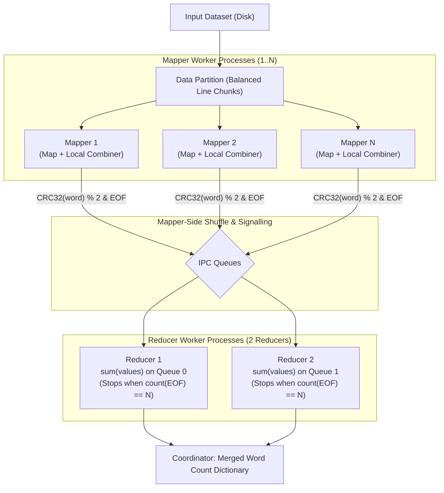

# MapReduce-Style Word Count (Option 2 — Cloud Programming Model)

**Course:** INTE 22253 — Distributed Systems & Cloud Computing  
**Task:** Part C (Option 2) — MapReduce-Style Word Count Simulation  
**Technology:** Python 3 (Standard Library: `multiprocessing`, `zlib`, `re`, `tkinter`, `threading`)

---

## 1. Project Overview

This project implements a complete local multiprocessing simulation of the **MapReduce programming model** for word frequency analysis, based on the foundational architecture by Dean & Ghemawat (2004).

The system simulates distributed execution on a multi-core machine using independent OS-level worker processes. It demonstrates the complete end-to-end lifecycle:
- **Data Partitioning:** Balanced contiguous line chunking across $N$ mapper workers.
- **Map Phase:** Tokenization, normalization, and `(word, 1)` pair generation.
- **Combiner Phase:** In-mapper local aggregation (`local_combiner[word] += 1`) to minimize inter-process communication (IPC) traffic by **>99%**.
- **Mapper-Side Shuffle Phase:** Deterministic routing using stable **CRC32 hashing** (`zlib.crc32(word) % num_reducers`) to assign words to reducers.
- **Explicit Termination Signalling:** Mappers send End-of-Data (EOF) signals to each reducer queue; reducers terminate strictly after receiving EOF signals from all $N$ mappers (no timeouts or race conditions).
- **Reduce Phase:** Parallel reducers aggregate frequencies using `sum(values)`.
- **Correctness Verification:** Automated key-by-key comparison against a single-process baseline with `PASS: Results match!` validation.
- **Empirical Benchmarking:** Multi-run performance analysis evaluating scaling across 1, 2, and 4 mapper configurations.
- **Interactive Desktop GUI:** Thread-safe Tkinter application displaying live pipeline stage logs, summary metrics cards, and a scrollable word frequency results table.

---

## 2. System Architecture Diagrams

### Diagram 1: Overall Local MapReduce Architecture (Mapper-Side Shuffle)

```
                            INPUT FILE
                                │
                                ▼
                         DATA PARTITION
                                │
                 ┌──────────────┼──────────────┐
                 ▼              ▼              ▼
              MAPPER 1       MAPPER 2      MAPPER N
                 │              │              │
                 ▼              ▼              ▼
             COMBINER 1    COMBINER 2     COMBINER N
                 │              │              │
                 └──────────────┼──────────────┘
                                │
                  MAPPER-SIDE SHUFFLE (CRC32)
                  & REDUCER EOF SIGNALLING
                                │
                       ┌────────┴────────┐
                       ▼                 ▼
                   REDUCER 1         REDUCER 2
                   (Queue 0)         (Queue 1)
                       │                 │
                       └────────┬────────┘
                                ▼
                         FINAL WORD COUNT
```



---

### Diagram 2: Local Simulation vs. Conceptual Cloud Deployment

```
========================================================================================
LOCAL MULTIPROCESSING SIMULATION              CONCEPTUAL CLOUD DEPLOYMENT
========================================================================================
[ Single Physical Host / Laptop ]             [ Distributed Cloud Infrastructure ]

  Local Storage (Disk / SSD)                    Cloud Object Storage (S3 / GCS / Azure Blob)
              │                                                     │
              ▼                                                     ▼
     Python Coordinator                            Distributed Scheduler (K8s / YARN / Ray)
              │                                                     │
   ┌──────────┼──────────┐                         ┌────────────────┼────────────────┐
   ▼          ▼          ▼                         ▼                ▼                ▼
Process 1  Process 2  Process N              Cloud VM / Pod 1 Cloud VM / Pod 2 Cloud VM / Pod N
 (Mapper)   (Mapper)   (Mapper)                  (Mapper)         (Mapper)         (Mapper)
   │          │          │                         │                │                │
   ▼          ▼          ▼                         ▼                ▼                ▼
Combiner   Combiner   Combiner                 Combiner         Combiner         Combiner
   │          │          │                         │                │                │
   └──────────┼──────────┘                         └────────────────┼────────────────┘
              │                                                     │
    OS IPC Pipes / Queues                        Network Transport (gRPC / HTTP/2 / TCP)
              │                                                     │
       ┌──────┴──────┐                                       ┌──────┴──────┐
       ▼             ▼                                       ▼             ▼
   Process 4     Process 5                               Cloud VM / Pod   Cloud VM / Pod
   (Reducer 1)   (Reducer 2)                               (Reducer 1)      (Reducer 2)
       │             │                                       │             │
       └──────┬──────┘                                       └──────┬──────┘
              ▼                                                     ▼
      Merged Result in RAM                           Output Dataset to Cloud Storage
========================================================================================
```

---

## 3. Project Structure

```
MapReduce/
├── main.py                               # Unified CLI & GUI entry point
├── gui.py                                # Interactive Tkinter desktop GUI (Stage logs + Results table)
├── mapreduce_core.py                     # Multiprocessing MapReduce engine with Mapper-side Shuffle & EOF signalling
├── baseline.py                           # Single-process sequential baseline word count
├── normalizer.py                         # Shared word normalization logic (identical across all stages)
├── generate_data.py                      # Synthetic dataset generator with fixed random seed (42)
├── benchmark.py                          # Automated correctness check & 3-trial performance harness
├── performance_results.csv               # Recorded empirical performance metrics across configurations
├── sample_data/
│   ├── correctness_50k.txt               # 50,000-line dataset for correctness verification (~3.8 MB)
│   └── final_word_counts.txt             # Sample top-100 aggregated word frequencies
├── SYSTEM_ARCHITECTURE_AND_GUI_GUIDE.md  # Architectural guide and step-by-step GUI trigger breakdown
├── PART_C_FULL_ARCHITECTURE_ANALYSIS.md     # Deep-dive theoretical analysis, Amdahl's Law, and Viva defense
└── README.md                             # Project overview and usage documentation
```

---

## 4. Key Implementation Rules & Guarantees

### 4.1 Word Normalization Rule
Baseline, Mapper, and Correctness tests use the exact same normalization function in `normalizer.py`:
1. Convert text to **lowercase**.
2. Keep **letters (`a-z`)**, **digits (`0-9`)**, and **apostrophes (`'`)** (e.g. `don't`, `it's`, `cloud2026`).
3. Remove all other punctuation (commas, periods, brackets, exclamation points).
4. Strip standalone apostrophes and filter out empty tokens.

### 4.2 Mapper-Side Shuffle & Stable CRC32 Hashing
Python's built-in `hash()` is randomized across processes per PEP 456 (SipHash seed randomization). To guarantee that the same word always routes to the exact same reducer across processes:
```python
import zlib
reducer_id = zlib.crc32(word.encode("utf-8")) % num_reducers
```

### 4.3 Reducer Termination (Deterministic EOF Signalling)
Because mapper-side shuffle routes data directly to reducers:
1. Each mapper sends an explicit `("__EOF_SIGNAL__", mapper_id)` sentinel to **every** reducer queue upon completing its partition.
2. Each reducer maintains a `completed_mappers` set.
3. A reducer terminates **strictly when `len(completed_mappers) == N` (the total number of mappers)**.
4. No timeouts are used for normal termination.

### 4.4 Queue Safety & Deadlock Prevention
To prevent IPC queue buffer deadlocks:
- In-mapper combiners aggregate intermediate pairs, reducing IPC queue messages by **>99%**.
- The coordinator consumes all reducer partition results from `result_queue` **before** executing `.join()` on worker processes.

### 4.5 Timing Scope
The timing scope is **strictly consistent** between Baseline and MapReduce:
- Starts when reading/loading the dataset from disk.
- Includes partitioning, worker startup, mapper tokenization/combining, IPC shuffling, reducer aggregation, and final dictionary merging.
- Ends when the final word count dictionary is ready.

---

## 5. Setup & Execution Instructions

### Prerequisites
- Python 3.8+ (Tested on Python 3.14.7)
- Standard library only — no external `pip` dependencies required.

### 1. Launch Interactive Graphical User Interface (GUI)
```bash
python3 gui.py
# or:
python3 main.py --gui
```

```
+-------------------------------------------------------------+
| MapReduce Word Count Processor                              |
+-------------------------------------------------------------+
| Input File: [/path/to/correctness_50k.txt] [Browse...]      |
|                                                             |
| Mapper Workers: [4]    Reducers: 2 (Fixed) Combiner: Enabled|
|                                                             |
| [ ▶ Run MapReduce Job ]    [ ✔ Verify Correctness ]         |
|                                                             |
| +-------------+  +--------------+  +------------+  +------+ |
| | TOTAL WORDS |  | UNIQUE WORDS |  |    TIME    |  |STATUS| |
| |   496,733   |  |    1,175     |  |  0.1933 s  |  |COMPL.| |
| +-------------+  +--------------+  +------------+  +------+ |
|                                                             |
| Execution Log (Pipeline Stages)                             |
| +---------------------------------------------------------+ |
| | [Coordinator] Reading input file from disk...           | |
| | [Coordinator] Input loaded: 50,000 lines read           | |
| | [Coordinator] Partitioning input: 4 chunks assigned     | |
| | [Mapper 1–4] Started map phase                          | |
| | [Mapper 1–4] Combiner completed                         | |
| | [Mapper 1–4] Mapper-side Shuffle completed              | |
| | [Reducer 0–1] Completed: All Mapper EOFs received       | |
| | [Coordinator] Final result merged: Job completed!       | |
| +---------------------------------------------------------+ |
|                                                             |
| Word Count Results Table                                    |
| +---------------------------------------------------------+ |
| | #  | Word                     | Count / Frequency       | |
| | 1  | item                     | 14,877                  | |
| | 2  | whereas                  | 14,877                  | |
| | 3  | in                       | 10,627                  | |
| | ...| ...                      | ...                     | |
| +---------------------------------------------------------+ |
+-------------------------------------------------------------+
```

### 2. Run MapReduce Job (CLI)
```bash
# Default run (4 mappers, 2 reducers on 50k dataset):
python3 main.py

# Custom dataset and mapper count:
python3 main.py --file sample_data/correctness_50k.txt --mappers 4
```

### 3. Run Sequential Baseline
```bash
python3 main.py --baseline --file sample_data/correctness_50k.txt
```

### 4. Verify Correctness (PASS Check)
```bash
python3 main.py --verify
```
*Expected Output:*
```
****************************************
  PASS: Results match!
****************************************
```

### 5. Run Performance Benchmark (Generates CSV)
```bash
python3 main.py --benchmark
```

---

## 6. Empirical Performance Results

### Test Environment
- **Host CPU:** Apple M3 (8 Cores: 4 Performance + 4 Efficiency)
- **RAM:** Unified Memory
- **Operating System:** macOS (Darwin 25.1.0)
- **Dataset Size:** 500,000 lines (~37.86 MB, 4,972,912 total words, 1,175 unique keys)
- **Trials per Configuration:** 3 runs (Averaged)

### Actual Recorded Measurements (`performance_results.csv`)

| Configuration | Mappers | Reducers | Run 1 (s) | Run 2 (s) | Run 3 (s) | Average (s) | Speedup vs Baseline |
| :--- | :---: | :---: | :---: | :---: | :---: | :---: | :---: |
| **Baseline (Single Process)** | 1 | 0 | 1.0342 | 1.0194 | 1.0655 | **1.0397** | **1.00x** |
| **MapReduce (1M + 2R)** | 1 | 2 | 1.0564 | 1.0678 | 1.2380 | **1.1207** | **0.93x** |
| **MapReduce (2M + 2R)** | 2 | 2 | 0.8188 | 0.7410 | 0.7285 | **0.7628** | **1.36x** |
| **MapReduce (4M + 2R)** | 4 | 2 | 0.5025 | 0.5005 | 0.4953 | **0.4994** | **2.08x** |

### Performance Analysis
1. **1 Mapper Overhead (0.93x):** Running MapReduce with 1 mapper and 2 reducers is slightly slower than the single-process baseline (1.1207s vs 1.0397s) because process spawning, IPC queue serialization (`pickle`), and coordinator context switching add overhead that cannot be offset by a single worker.
2. **Parallel Scaling (1.36x and 2.08x):** Scaling to 2 and 4 mappers achieves significant execution time reductions (from 1.0397s down to 0.4994s), confirming that parallel CPU workers successfully divide the tokenization, normalization, and local aggregation workload.
3. **Sublinear Speedup:** 4 mappers achieve a 2.08x speedup rather than 4.0x. This is explained by **Amdahl's Law**: sequential portions (reading the file from disk, partitioning lines, final dictionary merging) and IPC queue synchronization impose a theoretical ceiling on parallel efficiency.

---

## 7. Comprehensive Viva Voce Examination Defense

| Question | Model Viva Answer |
|---|---|
| **What is MapReduce?** | *A distributed programming model and runtime framework designed by Dean & Ghemawat (2004) for processing large datasets in parallel across clusters using two primary functions: Map and Reduce, connected by a Shuffle stage.* |
| **What is the purpose of the Combiner?** | *A Combiner acts as a "mini-reducer" executing locally inside each mapper process. It performs local aggregation (e.g. combining multiple `(word, 1)` into `(word, k)`) before data is transmitted over the queues, reducing IPC messages by >99%.* |
| **Why use `multiprocessing.Process` instead of `threading.Thread` in Python?** | *Due to Python's Global Interpreter Lock (GIL), multiple threads cannot execute Python bytecode in parallel on multiple CPU cores for CPU-bound tasks. `multiprocessing.Process` creates separate OS processes with independent memory spaces and separate GILs, enabling true multi-core parallel execution.* |
| **Why must CRC32 be used instead of Python's built-in `hash()`?** | *Python's built-in `hash()` incorporates a randomized per-process seed (PEP 456) for security against hash-collision attacks. Consequently, `hash("word")` in Mapper 1 yields a different integer than in Mapper 2. `zlib.crc32()` provides a stable, deterministic 32-bit checksum across all processes.* |
| **How does the system prevent deadlocks when using IPC queues?** | *Standard IPC queues have finite OS buffer limits. If mappers write to a full queue while waiting for reducers, or if reducers write to `result_queue` while coordinator waits on `join()`, processes will deadlock. Our implementation drains and collects reducer results before calling `process.join()`.* |
| **How do Reducers know when all Mappers are finished?** | *Each mapper sends an explicit EOF sentinel `("__EOF_SIGNAL__", mapper_id)` to each reducer. Reducers increment an internal completion counter and terminate strictly when signals from all $N$ mappers have been collected.* |

---

## 8. Reference

Dean, J. and Ghemawat, S. (2004). "MapReduce: Simplified Data Processing on Large Clusters," *Proceedings of the 6th USENIX Symposium on Operating Systems Design and Implementation (OSDI)*, pp. 137–150.
