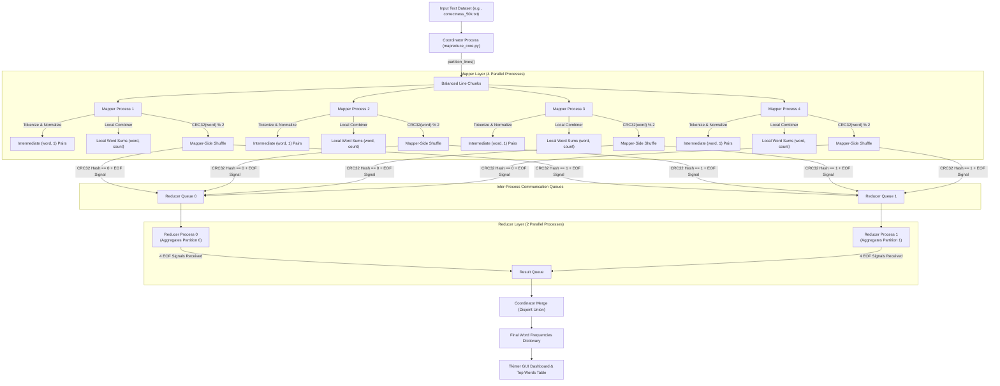

# MapReduce Word Count Simulator: System Architecture & GUI Guide

**Course Module:** INTE 22253 — Cloud Computing  
**Project Option:** Option 2 — Local Multiprocessing MapReduce Word Count Simulation  

---

## 1. System Overview

This project is a high-performance, local multiprocessing simulation of Google's **MapReduce distributed programming model** for large-scale word count aggregation. 

It demonstrates how large text datasets are processed concurrently using:
- Independent Python worker processes (`multiprocessing.Process`) that bypass the Python **Global Interpreter Lock (GIL)**.
- Inter-Process Communication (IPC) via thread-safe and process-safe `multiprocessing.Queue`.
- Mapper-side **local Combiner** aggregation to minimize inter-process communication overhead.
- Deterministic **CRC32 hash partitioning** to route intermediate keys to Reducers.
- Explicit **End-of-Data (EOF) termination signals** for deadlock-free reducer termination.
- An interactive **Tkinter GUI** with non-blocking background threading and thread-safe UI updates.

---

## 2. End-to-End System Architecture



---

## 3. Detailed Step-by-Step Execution Pipeline

### Stage 1: Input Loading & Line Partitioning
1. The **Coordinator** reads all text lines from disk into memory.
2. The dataset is split into 4 contiguous, balanced slices using `partition_lines()`:
   $$\text{Chunk Size} = \lfloor \frac{\text{Total Lines}}{N} \rfloor$$
3. Each chunk is assigned to one dedicated **Mapper worker process** ($M_1, M_2, M_3, M_4$).

### Stage 2: Map & Normalization
1. Each mapper worker receives its assigned chunk of raw text lines.
2. Each line is tokenized using `tokenize_and_normalize()` from `normalizer.py`:
   - Words are converted to lowercase, and tokens containing letters, digits, and apostrophes are retained. Other punctuation is removed.

### Stage 3: Mapper-Side Combiner (Local Aggregation)
1. Rather than pushing every individual `(word, 1)` pair across multiprocessing queues, the mapper aggregates words locally into an internal dictionary:
   $$\text{local\_combiner}[\text{word}] += 1$$
2. **Why this matters for Viva:** A single dataset might contain 500,000 words but only 1,200 unique words. The Combiner reduces inter-process IPC queue messages from 500,000 down to 1,200 (a **99.07% reduction** in queue contention).

### Stage 4: Mapper-Side Shuffle (CRC32 Partitioning)
1. Each unique word in the combiner is routed to a target reducer using standard 32-bit CRC32 hashing:
   $$\text{Reducer ID} = \text{CRC32}(\text{word.encode('utf-8')}) \pmod 2$$
2. **Properties of CRC32:**
   - **Deterministic:** The exact same word is guaranteed to always go to the exact same reducer.
   - **Disjoint:** Reducer 0 and Reducer 1 receive completely separate sets of words, preventing overlap.
3. Batched word tuples are pushed into `reducer_queues[0]` or `reducer_queues[1]`.
4. Once all data is sent, each mapper sends an explicit **EOF Sentinel Signal** (`("__EOF_SIGNAL__", mapper_id)`) to **both** reducer queues.

### Stage 5: Reduce Aggregation
1. Reducer 0 and Reducer 1 run in parallel, listening to their respective input queues.
2. Each reducer consumes batches of `(word, count)` pairs and computes:
   $$\text{final\_counts}[\text{word}] += \text{count}$$
3. **Deterministic Termination:** A reducer terminates only after it receives EOF signals from **all 4 mappers** ($4/4$).
4. Each reducer puts its finalized sub-dictionary onto the shared `result_queue`.

### Stage 6: Coordinator Merge & Output Generation
1. The Coordinator reads the completed dictionaries from `result_queue`.
2. Because CRC32 ensures disjoint keys, the Coordinator combines the two partitions directly:
   $$\text{final\_word\_counts} = \text{Partition}_0 \cup \text{Partition}_1$$
3. Total word counts, unique word counts, and elapsed time are calculated and returned to the caller.

---

## 4. GUI Architecture & Thread-Safety Mechanism

Tkinter is **single-threaded by design**; its underlying Tcl/Tk event loop runs exclusively on Python's main thread (Thread 0).

```
┌─────────────────────────────────────────────────────────────┐
│                       MAIN THREAD                           │
│  ┌───────────────────────────────────────────────────────┐  │
│  │ Tkinter Event Loop (root.mainloop)                    │  │
│  │  - Renders UI widgets & animations                    │  │
│  │  - Dispatches Button clicks                           │  │
│  │  - Polls ui_queue via root.after(50, _process_ui_queue)│  │
│  │  - Polls log_queue via root.after(80, _process_log_queue) │
│  └──────────────────────────▲────────────────────────────┘  │
└─────────────────────────────┼───────────────────────────────┘
                              │ Thread-Safe Queue.put()
┌─────────────────────────────┼───────────────────────────────┐
│                      WORKER THREAD                          │
│  ┌──────────────────────────┴────────────────────────────┐  │
│  │ threading.Thread(target=task, daemon=True)            │  │
│  │  - Spawns multiprocess MapReduce job                  │  │
│  │  - Gathers execution metrics and word counts          │  │
│  │  - Puts UI update callbacks into ui_queue             │  │
│  │  - Puts log messages into log_queue                   │  │
│  └───────────────────────────────────────────────────────┘  │
└─────────────────────────────────────────────────────────────┘
```

### Why Background Threads (`threading.Thread`) are Required:
If `run_mapreduce_job` were executed on the main thread, the entire GUI window would **freeze**, become unresponsive ("Not Responding" beachball cursor on macOS), and fail to repaint until the job finished. Spawning execution in a separate `threading.Thread(target=task, daemon=True)` keeps the Tkinter window responsive at 60 FPS.

### Why `ui_queue` is Required:
In Python 3.12+, calling Tkinter methods (`.config()`, `StringVar.set()`, `root.after()`) directly from a background thread raises `RuntimeError: main thread is not in main loop` or corrupts native Cocoa widget states.
- The background thread enqueues lambdas into `self.ui_queue`.
- The main thread periodically runs `_process_ui_queue()` via `root.after(50, ...)`, popping and executing tasks safely on the main thread.

---

## 5. How Each GUI Button & Section Works

### Section 1: Input Dataset
- **File Entry Box:** Displays the absolute path of the currently selected dataset file (defaults to `sample_data/correctness_50k.txt`).
- **`Browse...` Button:**
  - **Function:** `_browse_file()`
  - **How it works:** Opens a native file dialog (`filedialog.askopenfilename()`) filtered to `.txt` files.
  - **Result:** Updates `dataset_var`, pointing the MapReduce pipeline to the user's chosen text file.

---

### Section 2: MapReduce Architecture (Configuration Display)
Displays the fixed parameters representing the assignment specifications:
- **Mapper Workers:** 4 Parallel Worker Processes
- **Reducer Workers:** 2 Parallel Worker Processes
- **Combiner:** Enabled (Mapper-Side Local Aggregation)
- **Shuffle Routing:** CRC32 Hash Modulo 2

---

### Section 3: Run Controls

#### Button 1: `▶ Run MapReduce Job`
- **Function:** `_start_mapreduce()`
- **Trigger Sequence:**
  1. **Validation:** Checks if the input file path exists.
  2. **Button Lockout:** Calls `_toggle_controls(True)` to disable the Run, Verify, and Browse buttons so the user cannot trigger concurrent overlapping jobs.
  3. **Status Update:** Sets status badge to `RUNNING` (blue).
  4. **Log Clearance:** Clears previous log output and table entries.
  5. **Spawns Worker Thread:** Launches `task()` inside `threading.Thread(daemon=True)`.
  6. **Multiprocessing Execution:** Calls `run_mapreduce_job(file_path, num_mappers=4, num_reducers=2, log_callback=self._log)`.
  7. **Results Callback:** Calls `_display_results()`, which updates:
     - Status Badge $\rightarrow$ `COMPLETED` (green)
     - Execution Time $\rightarrow$ e.g., `0.2419 s`
     - Total Words $\rightarrow$ e.g., `496,733`
     - Unique Words $\rightarrow$ e.g., `1,175`
     - Populates the **Top Word Frequencies Table** with the top 25 words sorted descending.
  8. **Re-enabling:** `finally:` block executes `_toggle_controls(False)`, safely re-enabling all buttons.

#### Button 2: `✔ Verify Correctness (PASS Check)`
- **Function:** `_start_verification()`
- **Trigger Sequence:**
  1. **Validation & Lockout:** Disables buttons and sets status to `VERIFYING` (amber).
  2. **Stage 1 (Baseline):** Executes single-threaded `run_baseline(file_path)` and records baseline word counts and execution time.
  3. **Stage 2 (MapReduce):** Executes multiprocess `run_mapreduce_job(file_path, num_mappers=4, num_reducers=2)`.
  4. **Stage 3 (Comparison):** Evaluates `b_counts == mr_counts` (exact dictionary key-value match).
  5. **Outcome:**
     - **If Match:** Status Badge $\rightarrow$ `PASS: MATCH` (green), logs `PASS: Baseline & MapReduce results match 100%!`, and populates the table.
     - **If Mismatch:** Status Badge $\rightarrow$ `FAIL: MISMATCH` (red).
  6. **Re-enabling:** `finally:` block restores all buttons to `NORMAL`.

---

### Section 4: Execution Results Dashboard
- **Status Badge:** Visual pill badge indicating system state (`IDLE`, `RUNNING`, `COMPLETED`, `VERIFYING`, `PASS: MATCH`, `ERROR`).
- **Execution Time:** Accurate benchmark duration measured using high-precision `time.perf_counter()`.
- **Total Words:** Sum of all word occurrences ($\sum \text{frequencies}$).
- **Unique Words:** Total number of distinct vocabulary keys ($|\text{keys}|$).

---

### Section 5: Top Word Frequencies Table
- Implemented using `ttk.Treeview` with custom styled headers.
- Displays the **Top 25 most frequent words** in the dataset:
  - **Column `#`:** Rank (1, 2, 3, ...)
  - **Column `Word`:** The normalized word string
  - **Column `Frequency (Count)`:** Comma-formatted occurrence count (e.g. `14,877`)
- Includes an attached vertical scrollbar.

---

### Section 6: Simple Execution Log
A clean, real-time activity log showing key milestones:
1. `[Stage 1] Loading input dataset file from disk...`
2. `✓ Input loaded: 50,000 lines read`
3. `✓ Input partitioned: Partition 1–4 assigned to Mappers`
4. `✓ Mapper 1–4 & Combiner: completed map and local aggregation`
5. `✓ Mapper 1–4 Shuffle: CRC32 partitioned and sent to Reducers`
6. `✓ Reducer 0–1: Completed word frequency aggregation`
7. `✓ Final result generated: All Reducer partitions merged.`

---

## 6. Viva / Oral Examination Cheatsheet

| Question | Recommended Answer |
|---|---|
| **What is the purpose of the Combiner?** | "The Combiner performs local map-side aggregation on `(word, 1)` pairs before data enters the inter-process queue. This reduces queue messages by over 99%, eliminating IPC bandwidth bottlenecks." |
| **Why use CRC32 for Shuffling?** | "CRC32 is a fast, deterministic 32-bit hash algorithm. Computing `CRC32(word) % num_reducers` guarantees that all instances of the same word are routed to the same reducer, producing completely disjoint partitions." |
| **How do Reducers know when to terminate?** | "Each mapper sends a special EOF Sentinel tuple `('__EOF_SIGNAL__', mapper_id)` to every reducer queue upon completion. Each reducer counts EOF signals and terminates strictly when it has received EOFs from all 4 mappers." |
| **How does your GUI avoid freezing during long jobs?** | "Multiprocessing jobs run inside a dedicated background thread (`threading.Thread`). Widget updates are dispatched to a thread-safe `ui_queue` and executed on Tkinter's main thread via `root.after()`." |
| **Why does MapReduce use multiprocessing instead of multithreading in Python?** | "Python's Global Interpreter Lock (GIL) limits pure multithreading to a single CPU core for CPU-bound tasks. `multiprocessing.Process` creates separate OS processes with independent memory and GILs, allowing true parallel execution across multiple CPU cores." |
| **How do you verify correctness?** | "We compare the MapReduce output dictionary key-by-key and value-by-value against a single-process sequential baseline (`baseline.py`) that uses the identical tokenizer and normalizer." |

---

## 7. Project File Structure Reference

| File | Purpose |
|---|---|
| [`main.py`](file:///Users/shagiththikananthakumar/Desktop/assignmente/MapReduce/main.py) | Unified CLI & GUI entrypoint (`--gui`, `--baseline`, `--verify`, `--benchmark`). |
| [`gui.py`](file:///Users/shagiththikananthakumar/Desktop/assignmente/MapReduce/gui.py) | Interactive Tkinter desktop GUI demonstration. |
| [`mapreduce_core.py`](file:///Users/shagiththikananthakumar/Desktop/assignmente/MapReduce/mapreduce_core.py) | Core MapReduce engine (Mappers, Combiner, CRC32 Shuffle, Reducers, Coordinator). |
| [`baseline.py`](file:///Users/shagiththikananthakumar/Desktop/assignmente/MapReduce/baseline.py) | Single-process sequential reference implementation. |
| [`normalizer.py`](file:///Users/shagiththikananthakumar/Desktop/assignmente/MapReduce/normalizer.py) | Text tokenizer and lower-case normalizer. |
| [`benchmark.py`](file:///Users/shagiththikananthakumar/Desktop/assignmente/MapReduce/benchmark.py) | Automated 3-trial performance harness comparing Baseline vs 1, 2, 4 Mappers. |
| [`generate_data.py`](file:///Users/shagiththikananthakumar/Desktop/assignmente/MapReduce/generate_data.py) | Synthetic text dataset generator (50k correctness, 500k performance). |
